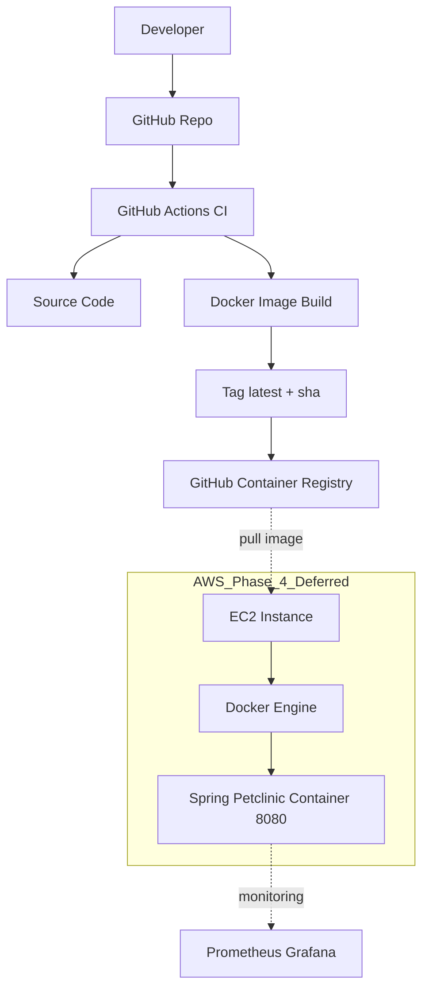

# Cloud Production CI/CD Pipeline

CI (Phase 3) completed: build + push image to GHCR

CD (Phase 4) deferred: terraform apply + deploy to EC2 будет позже (чтобы не тратить деньги)




## Overview

This project demonstrates a production-oriented DevOps pipeline implementing:

Infrastructure as Code → Configuration Management → CI/CD → Containerization → Registry → (Deployment-ready)

The goal of this project is to simulate a real-world cloud-ready workflow using industry-standard tools and best practices.

---

## Architecture

Developer pushes code →  
GitHub triggers CI pipeline →  
Docker multi-stage build runs →  
Container image is pushed to GitHub Container Registry (GHCR) →  
Image ready for deployment to EC2 (Phase 4)


```mermaid
flowchart TB
  dev[Developer] -->|git push| gh[GitHub Repo]
  gh --> ga[GitHub Actions CI]
  ga -->|build & test| ga2[Docker Build]
  ga2 -->|push image| reg[GHCR / Container Registry]

  subgraph AWS[Amazon Web Services (eu-central-1)]
    vpc[VPC] --> sg[Security Group]
    sg --> ec2[EC2 Instance]
    ec2 -->|docker run| app[Spring Petclinic Container :8080]
  end

  reg -->|docker pull| ec2
  user[User/Browser] -->|http://3.66.235.5:8080| app

```


## Tech Stack

- Terraform – Infrastructure as Code
- Ansible – Configuration Management
- Docker – Multi-stage container build
- GitHub Actions – CI/CD
- GitHub Container Registry (GHCR) – Image storage
- Spring Petclinic – Sample production-grade Java app

---
.
├── app/ # Application source (Spring Petclinic)
├── ansible/ # Configuration management
├── infrastructure/
│ └── terraform/ # Infrastructure as Code
├── .github/workflows/ # CI pipeline
├── Dockerfile # Multi-stage container build
└── README.md

---

## CI/CD Pipeline

### Trigger
- On push to `main`

### Steps
1. Checkout repository
2. Build Docker image (multi-stage Maven → JRE)
3. Tag image:
   - latest
   - sha-based tag
4. Push image to GHCR

---

## Docker Build Strategy

Multi-stage Docker build is used to:

- Reduce final image size
- Separate build and runtime environments
- Improve security (no Maven in runtime layer)

Build stage:
- Maven + JDK
- Package application

Runtime stage:
- Eclipse Temurin JRE
- Lightweight production container

---

## Registry

Images are published to:

ghcr.io/zared82-commits/cloud-production-ci-cd-pipeline


Tags:
- latest
- sha-<commit>

---

## Infrastructure (Prepared)

Terraform code provisions:

- VPC
- EC2
- Security groups

Deployment phase is prepared but intentionally postponed to avoid unnecessary cloud costs.

---

## Future Improvements

- Automated deployment to EC2
- Blue/Green deployment strategy
- Monitoring (Prometheus + Grafana)
- Log aggregation
- Image vulnerability scanning
- Automated rollback strategy

---

## Why This Project Matters

This repository demonstrates:

- End-to-end CI pipeline
- Containerized application delivery
- Infrastructure readiness
- Production-oriented architecture thinking

It reflects real-world DevOps workflow rather than isolated lab exercises.

---

## Author

Eduard Zaremba  
DevOps & AI Automation Engineer


## Project Structure

